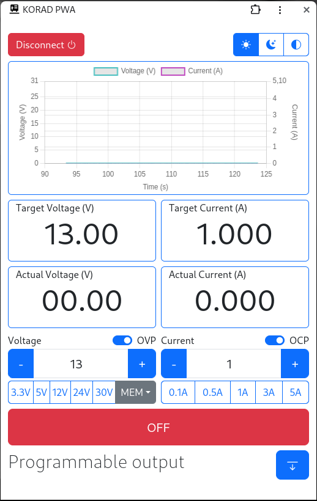

# PSU-PWA

Web PWA application using WebSerial for controling KORAD bench power supply [VISIT](https://p8sx.github.io/psu-pwa/) to use/install it.

## Supported devices

Application should support Korad, Tenma, Velleman bench power supply in all voltage range configurations 30-60V, 2-5A (only tested on Korad KA3005PS feel free to test it on different devices and notify me)

## Preview

## TODO

- [ ] Code cleanup
- [ ] Fix responsiveness/adaptivity to different sizes
- [ ] Add quick output modes
- [ ] Add data export possibility
- [ ] Add programmable outputs, e.g. programming voltage/current steps in given time periods
